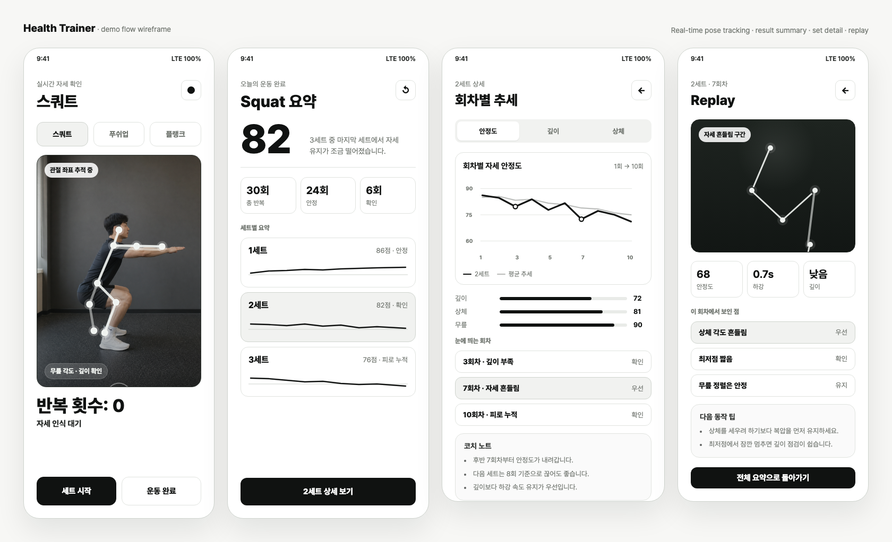
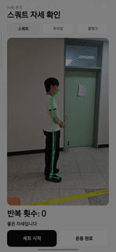
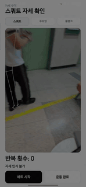
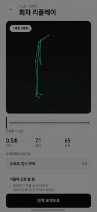
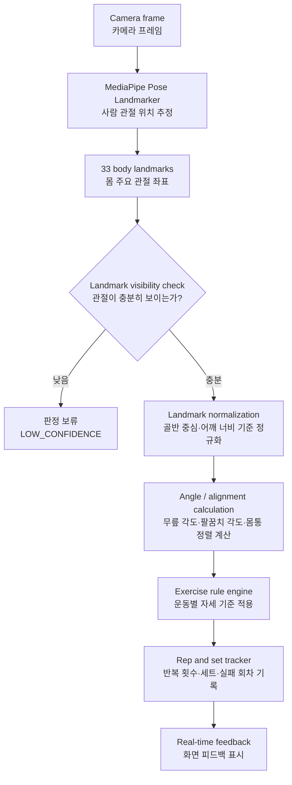

# Health Trainer



> 실제 사람이 스쿼트를 하는 카메라 화면에서 관절 좌표를 실시간으로 추정하고, 운동 후 전체 세트 요약, 세트별 추세 그래프, 문제 회차 리플레이로 이어지는 데모 와이어프레임입니다.

<table>
  <tr>
    <td align="center"><strong>양호한 자세</strong></td>
    <td align="center"><strong>나쁜 자세</strong></td>
  </tr>
  <tr>
    <td align="center"></td>
    <td align="center"></td>
  </tr>
</table>

<p align="center">
  <strong>리플레이</strong><br />
  
</p>

Health Trainer는 스마트폰 카메라로 운동 자세를 분석하는 Android 앱입니다. 스쿼트, 푸쉬업, 플랭크를 할 때 사람의 관절 좌표를 실시간으로 추정하고, 그 자세가 기준에 얼마나 맞는지 확인합니다.

이 앱은 "운동을 열심히 하고 있는데, 내가 지금 제대로 하고 있는 걸까?"라는 고민에서 시작했습니다. 헬스장에서든 집에서든 운동을 하다 보면 횟수는 채울 수 있지만, 무릎이 안으로 말리는지, 푸쉬업 때 허리가 처지는지, 스쿼트 깊이가 충분한지는 혼자 판단하기 어렵습니다. 그래서 카메라와 컴퓨터 비전 기술을 이용해 내 자세를 다시 보고, 어떤 회차에서 자세가 흔들렸는지 알 수 있는 앱을 만들고 싶었습니다.

완벽한 트레이너를 대체하는 앱이라기보다, 사용자가 자기 운동을 더 잘 이해하도록 도와주는 작은 코치에 가깝습니다. 내가 직접 운동하면서 필요하다고 느낀 기능을 기준으로 만들었고, 그래서 단순한 데모보다 애착을 가지고 계속 다듬고 싶은 프로젝트입니다.

## 앱이 하는 일

- 스마트폰 카메라로 사용자의 자세를 실시간 추정합니다.
- 화면에 관절 skeleton overlay를 표시합니다.
- 스쿼트, 푸쉬업, 플랭크 자세를 각도와 정렬 기준으로 판단합니다.
- 반복 횟수와 세트 기록을 추적합니다.
- 기준을 만족하지 못한 동작을 `1세트 2회차`처럼 남깁니다.
- 운동 후 저장된 관절 좌표를 바탕으로 skeleton replay를 볼 수 있습니다.
- 학습 모델은 자세 판단을 보조하는 힌트로 사용합니다.

## 지원 운동

| 운동 | 확인하는 내용 |
| --- | --- |
| 스쿼트 | 반복 횟수, 깊이 부족, 상체 과도 숙임, 무릎 정렬 |
| 푸쉬업 | 반복 횟수, 팔꿈치 굽힘 깊이, 몸통 라인 무너짐 |
| 플랭크 | 유지 시간, 엉덩이 높이, 어깨-엉덩이-발목 정렬 |

## MVP 설계 방향

이 프로젝트는 처음부터 전문 트레이너 수준의 완벽한 정자세 판정 모델을 만드는 것보다, 사용자가 납득할 수 있는 코칭 경험을 만드는 데 집중했습니다.

좋은 데모의 목표는 "모든 자세를 완벽하게 맞힌다"가 아니라, 사용자가 어떤 회차에서 어떤 자세 요소가 흔들렸는지 이해하고 다시 볼 수 있게 하는 것입니다.

```text
좋은 데모 목표:
운동을 완벽하게 평가한다
  -> X

사용자가 어떤 회차에서 어떤 자세 요소가 흔들렸는지 이해하고 다시 볼 수 있다
  -> O
```

그래서 초기 앱은 다음 원칙을 따릅니다.

- 포즈 추정은 MediaPipe Pose Landmarker처럼 검증된 모델을 사용합니다.
- 자세 판단은 관절 각도와 정렬 기준으로 설명 가능한 rule-based 방식을 기본으로 둡니다.
- 모델은 rule engine을 대체하지 않고, 보조 힌트로만 사용합니다.
- `틀렸습니다` 같은 단정적 표현보다 `깊이가 부족할 수 있습니다`, `몸통 정렬이 흔들렸습니다`처럼 보수적으로 피드백합니다.
- 카메라 구도나 landmark confidence가 낮으면 판정을 보류합니다.
- 운동 후에는 실패 회차, 세트별 요약, skeleton replay를 통해 사용자가 근거를 확인할 수 있게 합니다.

## 컴퓨터 비전 흐름

앱은 CameraX로 카메라 프레임을 받고, MediaPipe Pose Landmarker로 사람의 관절 위치를 추정합니다. MediaPipe는 몸의 주요 지점을 33개 landmark로 반환합니다.



화면에 그리는 skeleton에는 image coordinate를 사용하고, 자세 계산과 리플레이에는 world coordinate를 사용합니다. 관절 visibility가 낮으면 자세를 단정하지 않고 판정을 보류합니다. 잘못 잡힌 좌표 하나로 사용자의 자세를 틀렸다고 말하지 않기 위해서입니다.

좌표는 사람마다 키와 카메라 거리가 다르기 때문에 정규화해서 사용합니다.

```text
hip_center = midpoint(left_hip, right_hip)
scale = distance(left_shoulder, right_shoulder)
normalized_landmark = (landmark - hip_center) / scale
```

이렇게 하면 화면 안 위치나 몸 크기가 달라도 비슷한 기준으로 자세를 비교할 수 있습니다.

## 자세 판단 방식

Health Trainer의 기본 판단은 rule-based 방식입니다. 모델이 무작정 "정답/오답"을 말하는 것이 아니라, 관절 각도와 신체 정렬을 계산해서 설명 가능한 기준으로 판단합니다.

### 스쿼트

스쿼트는 측면 카메라 구도를 기준으로 분석합니다.

- 무릎 각도가 충분히 작아졌는지 확인합니다.
- 최저점에서 깊이가 부족하면 실패로 기록합니다.
- 상체가 과하게 앞으로 무너졌는지 확인합니다.
- `standing -> bottom -> standing` 흐름이 완성되면 1회로 카운트합니다.

얕은 스쿼트는 그냥 무시하지 않습니다. 동작은 1회로 카운트하되, `스쿼트 깊이 부족`이라는 실패 사유를 남깁니다. 사용자가 "몇 회를 했는지"뿐 아니라 "그중 몇 회가 아쉬웠는지"를 알 수 있게 하기 위해서입니다.

### 푸쉬업

푸쉬업은 팔꿈치 각도와 몸통 라인을 중심으로 봅니다.

- 팔꿈치 각도로 `up`, `down` 상태를 구분합니다.
- `up -> down -> up` 흐름이 완성되면 1회로 카운트합니다.
- 팔꿈치가 충분히 굽혀지지 않으면 깊이 부족으로 봅니다.
- 어깨-엉덩이-발목 라인이 무너지면 몸통 정렬 문제로 봅니다.

푸쉬업 횟수 측정은 모델보다 rule-based state machine이 더 안정적이라고 판단했습니다. 그래서 현재 구조에서는 모델이 횟수를 세지 않고, rule engine이 카운팅을 담당합니다.

### 플랭크

플랭크는 반복 운동이 아니라 hold 운동으로 처리합니다.

- 어깨-엉덩이-발목 라인이 유지되는지 확인합니다.
- 엉덩이가 과하게 올라가거나 내려가는지 확인합니다.
- 팔꿈치가 어깨 아래에 가까운지 확인합니다.
- 전체 프레임 중 유효 자세 비율로 성공 여부를 판단합니다.

## 세트별 실패 기록

운동 중에는 프레임마다 자세를 분석하지만, 최종 실패 여부는 한 프레임만 보고 결정하지 않습니다. 한 번의 반복 동작에 포함된 여러 프레임을 모아서 rep 단위로 평가합니다.

```text
TOP
-> DESCENT
-> DOWN
-> TOP
-> rep 종료
-> rep 전체 기준으로 성공/실패 판단
```

예를 들어 스쿼트 10회를 했을 때 2회차만 깊이가 부족했다면 결과 화면에는 다음처럼 남습니다.

```text
1세트 결과
총 10회 중 9회 성공

실패 동작
- 2회차: 스쿼트 깊이 부족
```

이 기능을 만든 이유는 단순합니다. 운동을 하고 나면 보통 "몇 회 했는지"만 남는데, 실제로 중요한 건 "어느 회차에서 자세가 무너졌는지"라고 생각했기 때문입니다.

## 모델 학습과 튜닝

기본 자세 판단은 rule-based로 만들었지만, 모델 학습도 별도 트랙으로 진행했습니다. 모델은 앱의 판단을 대체하지 않고, rule만으로 보기 어려운 자세 패턴을 보조하는 역할입니다.

```text
rule engine
-> 기본 자세 판단
-> rep count
-> valid / invalid 기록

form classifier
-> 보조 힌트
-> 자세 분류 결과를 추가로 표시
```

사용한 공개 데이터셋은 Kaggle에서 가져왔습니다.

```text
스쿼트 데이터셋:
- Kaggle Squat Exercise Pose Dataset
- https://www.kaggle.com/datasets/thashmiladewmini/squat-exercise-pose-dataset
- MediaPipe 기반 자세 feature가 이미 계산되어 있는 tabular dataset

푸쉬업 데이터셋:
- Kaggle Pushup Dataset
- https://www.kaggle.com/datasets/mohamadashrafsalama/pushup
- Correct sequence/*.mp4, Wrong sequence/*.mp4 형태의 raw video dataset
```

스쿼트 데이터셋은 이미 관절 각도와 자세 관련 feature가 표 형태로 정리되어 있어서 바로 학습에 사용할 수 있었습니다.

```text
input: 12 pose features
labels:
  - correct
  - shallow_squat
  - forward_lean
  - knees_caving_in
  - heels_off_ground
  - asymmetric_squat
```

처음에는 RandomForest를 baseline으로 학습했습니다. 이후 Colab에서 모델을 비교하면서 accuracy만 보지 않고 macro F1, confusion matrix, 클래스별 recall을 함께 확인했습니다. 특히 `asymmetric_squat`처럼 correct와 헷갈리기 쉬운 클래스를 따로 확인하면서 모델을 튜닝했습니다.

푸쉬업 데이터셋은 스쿼트와 달리 feature CSV가 아니라 영상 파일입니다. 그래서 영상에서 바로 모델을 학습하는 것이 아니라, 먼저 앱과 같은 방식으로 MediaPipe 관절 좌표를 추출한 뒤 푸쉬업 1회 단위의 feature 표로 바꿉니다.

```text
푸쉬업 영상
-> MediaPipe Pose Landmarker
-> 프레임별 어깨 / 팔꿈치 / 손목 / 엉덩이 / 발목 좌표
-> 팔꿈치 각도와 몸통 라인 각도 계산
-> 팔 편 상태 -> 내려감 -> 다시 팔 편 상태 기준으로 rep 분할
-> rep 1개당 10개 feature 생성
-> correct / incorrect 이진 분류 모델 학습
```

푸쉬업에서 사용하는 rep-level feature는 다음과 같습니다.

```text
min_elbow_angle          가장 많이 내려갔을 때 팔꿈치 각도
max_elbow_angle          가장 폈을 때 팔꿈치 각도
mean_elbow_angle         한 rep 동안의 평균 팔꿈치 각도
elbow_angle_range        팔꿈치가 움직인 범위
min_body_line_angle      가장 무너진 몸통 라인 각도
mean_body_line_angle     평균 몸통 라인 각도
body_line_broken_ratio   몸통 라인이 무너진 프레임 비율
visible_frame_ratio      관절이 신뢰도 있게 보인 프레임 비율
rep_duration_ms          푸쉬업 1회에 걸린 시간
down_phase_ratio         내려간 상태에 머문 비율
```

이렇게 하면 영상 하나를 통째로 `correct` 또는 `incorrect`로 학습하는 것이 아니라, 실제 앱이 판단하는 단위와 같은 `푸쉬업 1회` 기준으로 학습할 수 있습니다. 앱에서도 한 rep가 끝난 시점에 같은 feature를 만들기 때문에 학습할 때 본 입력과 실시간 추론할 때의 입력이 맞아집니다.

### 모델 평가에서 주의한 점

푸쉬업 학습에서는 처음에 `accuracy = 1.0`, `macro_f1 = 1.0`처럼 완벽해 보이는 결과가 나올 수 있었습니다. 하지만 이 수치는 그대로 믿으면 안 됩니다.

이유는 푸쉬업 데이터가 영상 단위이고, 한 영상 안에는 서로 매우 비슷한 여러 rep가 들어 있기 때문입니다. rep 단위로 무작위 train/test split을 하면 같은 영상에서 나온 rep 일부가 train에 들어가고, 같은 영상의 다른 rep가 test에 들어갈 수 있습니다.

```text
나쁜 split:
clip_01의 1회차 -> train
clip_01의 2회차 -> test

문제:
test가 사실상 이미 본 영상의 형제 rep가 됨
-> 성능이 과장됨
```

이런 문제를 group leakage라고 봤고, 현재 푸쉬업 학습 트랙에서는 영상 파일명을 group으로 사용해 같은 영상의 rep가 train/test에 동시에 들어가지 않도록 했습니다.

```text
정직한 split:
clip_01의 모든 rep -> train
clip_02의 모든 rep -> test
```

그리고 단일 test split만 보지 않고, 영상 단위 group k-fold cross-validation도 추가했습니다.

```text
Group train/test split:
-> 영상 단위 held-out 평가

Group k-fold CV:
-> 여러 영상 fold에서 평균 accuracy / macro F1 / 표준편차 확인
```

따라서 푸쉬업 모델의 진짜 성능은 `metrics_summary.json`의 `held_out`과 `cv`를 함께 보고 판단합니다. 특히 데이터가 작을 때는 한 번의 test accuracy보다 `cv.accuracy_mean`, `cv.accuracy_std`, `cv.macro_f1_mean`, `cv.macro_f1_std`가 더 중요합니다.

또한 영상별 진행 로그를 남겨서 어떤 영상에서 rep가 몇 개 추출되었는지도 확인합니다. 예를 들어 많은 영상에서 `0 reps`가 나오면 모델 문제가 아니라 MediaPipe 추출, 카메라 구도, rep segmentation threshold 문제일 수 있습니다.

모델을 앱에 넣을 때는 TFLite로 export합니다. 다만 모델 파일이 없어도 앱이 깨지면 안 되기 때문에, 현재 구조에서는 모델이 optional입니다.

```text
모델 파일 있음
-> rule-based 피드백 + 모델 보조 힌트

모델 파일 없음
-> rule-based 피드백만 사용
```

### 학습한 모델을 앱에서 쓰는 방식

모델을 앱에 넣는 과정은 크게 다섯 단계입니다.

```text
운동 데이터 준비
-> MediaPipe landmark 추출
-> 운동별 feature table 생성
-> Colab에서 모델 학습 및 평가
-> TFLite로 변환해서 Android assets에 추가
```

먼저 공개 데이터셋이나 직접 촬영한 운동 영상에서 관절 좌표를 뽑습니다. 영상 자체를 그대로 모델에 넣기보다, MediaPipe로 추출한 landmark와 관절 각도 같은 숫자 feature로 바꿔서 학습합니다. 이렇게 하면 모델이 배경이나 옷 색깔보다 실제 자세 변화에 더 집중할 수 있습니다.

전처리 결과는 모델이 읽을 수 있는 표 형태가 됩니다.

```text
min_elbow | max_elbow | body_line_broken_ratio | rep_duration_ms | label
85        | 168       | 0.05                   | 1200            | correct
121       | 166       | 0.10                   | 950             | incorrect
88        | 160       | 0.65                   | 1400            | incorrect
```

학습은 로컬 컴퓨터가 아니라 Google Colab에서 실행합니다. 로컬에서는 학습 코드와 feature 생성 코드를 작성하고 테스트하고, Colab에서는 Kaggle 데이터셋을 불러와 모델을 학습시킨 뒤 accuracy, macro F1, confusion matrix를 확인합니다. 성능이 괜찮은 모델만 앱에 넣을 후보로 봅니다.

앱에 넣을 때는 학습된 모델을 TensorFlow Lite 파일로 변환합니다.

```text
스쿼트 Colab 학습 결과
-> squat_form.tflite
-> app/src/main/assets/models/squat_form.tflite

푸쉬업 Colab 학습 결과
-> pushup_form.tflite
-> app/src/main/assets/models/pushup_form.tflite
```

Android 앱은 실행될 때 이 TFLite 파일을 읽어 `TfliteFormClassifier`로 준비합니다. 그리고 운동 중 매 프레임마다 모델을 돌리지는 않습니다. 실시간 카메라 앱에서 매 프레임 모델 추론을 많이 하면 화면이 느려질 수 있기 때문입니다.

대신 기본 자세 판단과 횟수 측정은 계속 rule engine이 담당하고, 모델은 한 번의 반복 동작이 끝났을 때만 보조로 실행합니다.

```text
카메라 프레임 입력
-> rule engine이 실시간 자세와 rep count 계산
-> rep가 끝나는 순간 feature 추출
-> TFLite 모델이 correct / incorrect 또는 자세 라벨 예측
-> confidence가 충분하면 화면에 보조 힌트 표시
```

즉, 모델은 앱의 중심 판단을 바꾸는 역할이 아니라, 사용자가 이해할 수 있는 추가 힌트를 주는 역할입니다. 모델 confidence가 낮거나 모델 파일이 없으면 앱은 조용히 rule-based 방식만 사용합니다.

푸쉬업 모델에서도 같은 원칙을 유지합니다. UI에서 사용자가 이미 푸쉬업을 선택하기 때문에 운동 종류 분류는 하지 않고, 모델은 `correct / incorrect` 자세 보조 판단만 담당합니다. 푸쉬업 횟수 측정은 여전히 rule-based state machine이 담당합니다.

## 3D Skeleton Replay

운동 중 추정된 world landmark를 저장하면 운동 후 자세를 skeleton 형태로 다시 볼 수 있습니다. 이 기능은 의료용 모션캡처가 아니라, 사용자가 자신의 자세 흐름을 다시 확인하기 위한 시각화입니다.

```text
운동 중:
landmark 저장
실패 rep 기록

운동 후:
skeleton replay
실패 구간 확인
```

내가 이 앱에서 특히 마음에 드는 부분은 결과가 단순한 숫자로 끝나지 않는다는 점입니다. `10회 성공` 같은 기록도 중요하지만, 내가 실제로 어떤 자세로 움직였는지 다시 보는 경험이 더 오래 남는다고 생각했습니다.

## 기술 스택

| 영역 | 기술 |
| --- | --- |
| Android App | Kotlin, Android Native |
| UI | Jetpack Compose |
| Camera | CameraX |
| Pose Estimation | MediaPipe Pose Landmarker |
| 자세 판단 | 관절 각도 계산, rule engine, state machine |
| 모델 학습 | Python, NumPy, scikit-learn, TensorFlow/Keras |
| 모델 배포 | TensorFlow Lite |
| 실험 환경 | Google Colab, Google Drive |
| 테스트 | JUnit, pytest |

## 프로젝트 구조

```text
health_trainer/
  app/
    src/main/java/com/healthtrainer/app/
      camera/        # CameraX preview
      pose/          # MediaPipe adapter
      ml/            # optional TFLite classifier
      replay/        # skeleton replay
      ui/            # Compose UI
  core/
    src/main/kotlin/com/healthtrainer/core/
      exercise/      # squat, push-up, plank rules
      features/      # model input features
      geometry/      # angle / distance utilities
      pose/          # pose data model
      tracker/       # rep / set tracker
  ml/
    src/             # training scripts
    configs/         # model configs
    notebooks/       # Colab runners
    tests/           # Python tests
  docs/
    plan.md
    model-training-plan.md
    colab-drive-workflow.md
    demo-script.md
```

## 실행 방법

Android SDK가 설치되어 있어야 합니다.

```bash
export ANDROID_HOME="$HOME/Library/Android/sdk"
export ANDROID_SDK_ROOT="$ANDROID_HOME"
export PATH="$ANDROID_HOME/platform-tools:$ANDROID_HOME/emulator:$ANDROID_HOME/cmdline-tools/latest/bin:$PATH"

./gradlew :core:test :app:assembleDebug
```

실기기에 설치하려면 USB 디버깅을 켠 뒤 실행합니다.

```bash
adb devices
./gradlew :app:installDebug
```

모델 학습 트랙은 로컬에서 코드를 작성하고, 실제 학습은 Colab에서 실행하는 방식으로 구성했습니다.

```bash
cd ml
uv venv --python 3.11
uv pip install -r requirements-dev.txt
.venv/bin/pytest
```

스쿼트 모델은 이미 계산된 feature CSV를 사용하므로 Colab에서 바로 학습할 수 있습니다.

```bash
python ml/src/train_squat_form_classifier.py \
  --run-dir "$RUNS_DIR/squat_form_classifier_v1"
```

푸쉬업 모델은 raw video를 처리해야 하므로 Colab에서 MediaPipe 추출까지 함께 실행합니다. 현재 학습 코드는 `model-training` 브랜치에 있고, Colab notebook에서는 이 브랜치를 다시 clone해야 최신 코드가 반영됩니다.

```bash
cd /content
rm -rf /content/health_trainer
git clone --branch model-training --single-branch \
  https://github.com/kimgt0128/health-trainer.git /content/health_trainer
cd /content/health_trainer
pip install -q mediapipe opencv-python "kagglehub[pandas-datasets]"
```

그 다음 푸쉬업 학습을 실행합니다. 기본값은 영상 단위 group split과 group k-fold CV를 사용합니다.

```bash
export PYTHONPATH=/content/health_trainer/ml/src

python ml/src/train_pushup_form_classifier.py \
  --run-dir "$RUNS_DIR/pushup_form_classifier_v1" \
  --test-size 0.2 \
  --random-state 42 \
  --group-by-clip \
  --cv-folds 5
```

학습이 끝나면 Drive run directory에 다음 파일이 생성됩니다.

```text
pushup_form_classifier.joblib
labels_pushup_form.json
feature_config.json
metrics_summary.json
```

`metrics_summary.json`에서는 단순 accuracy 하나만 보지 않고 다음 항목을 함께 확인합니다.

```text
split: group_by_clip
n_reps: 추출된 rep 수
n_clips: 사용된 영상 수
held_out: 영상 단위 test 결과
cv: group k-fold 평균과 표준편차
```

만약 `--no-group-by-clip`을 사용하면 rep 단위 random split이 되어 같은 영상의 rep가 train/test에 섞일 수 있습니다. 이 방식은 성능 비교용으로만 남겨둔 것이며, 보고서나 README에서 모델 성능으로 주장할 값은 아닙니다.

## 데모 흐름

1. 앱에서 스쿼트를 선택합니다.
2. 측면 카메라 구도로 실제 사람이 스쿼트하는 모습을 보며 skeleton overlay와 rep count를 확인합니다.
3. 정상 스쿼트 1회, 얕은 스쿼트 1회, 정상 스쿼트 1회를 수행합니다.
4. 세트 종료 후 `1세트 2회차: 스쿼트 깊이 부족` 기록을 확인합니다.
5. skeleton replay로 실패 구간을 다시 확인합니다.
6. 푸쉬업과 플랭크도 같은 구조로 자세를 분석할 수 있음을 보여줍니다.

## 이 프로젝트에서 중요하게 본 것

- 운동을 열심히 해도 자세가 맞는지 알기 어렵다는 실제 문제에서 출발했습니다.
- 카메라 영상에서 관절 좌표를 추출하고, 그 좌표를 직접 해석했습니다.
- 자세 판단 기준을 각도와 정렬로 설명할 수 있게 만들었습니다.
- 단순 횟수보다 "어느 회차에서 자세가 무너졌는지"를 기록하는 데 집중했습니다.
- 모델 학습은 앱을 대체하는 마법 같은 판단기가 아니라, rule-based 판단을 보조하는 현실적인 방식으로 붙였습니다.
- 내가 실제로 쓰고 싶은 앱이라는 기준으로 기능을 정했습니다.

## 참고 문서

- `docs/plan.md`: 전체 구현 계획
- `docs/model-training-plan.md`: 모델 학습 전략
- `docs/colab-drive-workflow.md`: Colab/Drive 실행 흐름
- `docs/demo-script.md`: 데모 흐름
- `ml/README.md`: 모델 학습 트랙 설명
